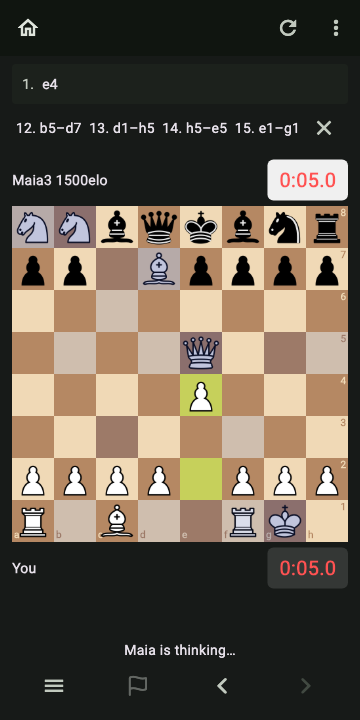
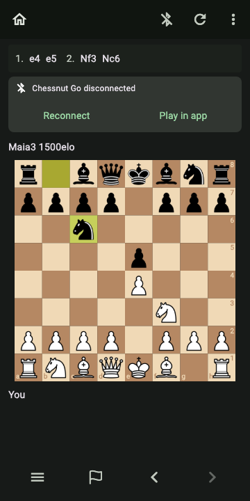
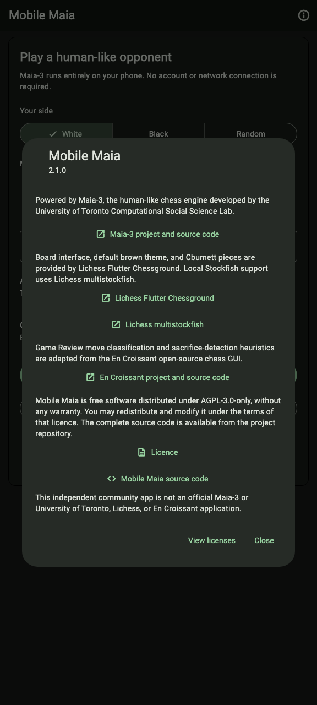

# Mobile Maia Preview

Mobile Maia Preview is the prerelease channel of the free, open-source Android
chess app for playing against the
human-like [Maia-3](https://github.com/CSSLab/maia3) model and reviewing games
with Maia and Stockfish. The model, engines, opening data, games, and analysis
all stay on the phone and work without an account or Internet connection.

Choose a Maia level from 500 to 2500, compare the move a person is likely to
play with Stockfish's best move, or run a complete game review without a daily
quota. Mobile Maia is an independent community project released under
AGPL-3.0-only. Its gold app icon and separate Android package let it run beside
the stable blue-icon Mobile Maia app without replacing it.

## Preview channel

Preview v2.1.0-beta.19 supplied the features promoted to stable Mobile Maia
2.1, including experimental Chessnut Go support, multiple premoves, endgame
draw offers, analysis-quality presets, historical clocks, timed-PGN
annotations, and stronger game and variation recovery. Future experimental
work continues here before promotion to the
[stable repository](https://github.com/Dash1971/maia-chess-android).

## Feature guide

The screenshots below were captured from the stable/main app in its test
environment. Preview currently shares these screens and features; only its
channel branding and gold icon differ.

### Choose a game or analysis workflow

<p align="center">
  
</p>

The home screen is the starting point for every workflow. Play as White, Black,
or a random side; choose a preset or custom Maia rating; then start a game.
**Analysis Board** opens a free-form position, **Recent games** restores saved
work, and **Open PGN file** imports a game from Android. Your side, rating,
clock, custom time values, and advanced settings are remembered locally.

### Time controls

<p align="center">
  
</p>

Games are unlimited by default. Lichess-style presets and custom minutes plus
increment are also available. Training clocks pause while the app is in the
background, while you review the current game, or after an engine error. Timed
PGNs use a standard `TimeControl` header and per-move `[%clk ...]` comments to
millisecond precision; unlimited games do not invent clock data.

### Advanced play and review settings

<p align="center">
  
</p>

Advanced settings control premoves, an optional exact 100 ms premove charge,
multiple queued premoves, human-like Maia timing, Temperature, Top-P, the Maia
rating used during review, and full-game analysis quality. **Thorough** is the
default; **Balanced** and **Fast** reduce review time by using shorter
Stockfish searches. **Copy diagnostics** creates a privacy-safe local report
for troubleshooting and never uploads it automatically.

### Maia sampling

<p align="center">
  
</p>

Maia predicts a probability distribution over legal human moves.
**Temperature** changes how strongly the app favours the most probable move;
Temperature 0 always chooses the top prediction. **Top-P** limits sampling to
the most likely moves whose cumulative probability reaches the chosen value.
The defaults—Temperature 0.5 and Top-P 0.9—provide variety while filtering
low-probability outliers. They change playing style and consistency, not the
model weights or Maia's nominal rating.

### Play against a human-like opponent

<p align="center">
  
</p>

Tap or drag pieces on the Lichess Chessground board. Maia-3 runs on-device and
selects moves for the chosen rating instead of behaving like a deliberately
weakened tactical engine. The live view shows both players, clocks, material
imbalance, the move strip, turn status, and game controls. The screen stays
awake during an active game, and the current position is checkpointed for
recovery after process death, restart, or an app update.

### Multiple premoves

<p align="center">
  
</p>

This main-app example queues an elaborate fifteen-step plan; the
ordered strip is scrolled to moves 12–15 and the board previews the projected
piece locations. Enable **Allow multiple premoves** to plan up to 64 moves while
Maia is thinking. After each Maia reply, only the next premove runs, and only
if it is legal in the actual position; an illegal move cancels everything that
follows. **Cancel premoves** clears the sequence immediately.

Premoves are available only for on-screen games. A separate setting can charge
exactly 0.1 seconds for each executed premove before applying the normal
increment. Without that setting, the default is one Lichess-style premove with
no fixed deduction. Navigation, takebacks, leaving or restarting the game, and
game completion all clear the queue.

### Navigation, takebacks, resignation, and draw offers

<p align="center">
  
</p>

The bottom toolbar opens game actions, resigns, and moves backward or forward
through played positions. Hold Back to jump to the starting position and hold
Forward to return to the latest position. Historical positions are read-only;
completed games also show the clock values belonging to the selected ply.

**Take back move** restores the playable board and clock while preserving the
abandoned continuation as a PGN variation. In sufficiently reduced endgames,
**Offer draw** asks for confirmation and lets local Stockfish decide whether
Maia accepts. Accepted offers are saved as draws by agreement.

### Game completion and rematches

<p align="center">
  
</p>

Checkmate, stalemate, timeout, resignation, and agreed draws produce a result
dialog. Open the finished position in **Analysis Board**, start a **Rematch**,
or return Home. A completed game remains in **Recent games** when you choose
**New game**; resetting an unfinished game uses a separate destructive
confirmation.

### Chessnut Go electronic-board play

<p align="center">
  
</p>

Experimental Chessnut Go support enters physical moves over Bluetooth and
lights Maia's reply on the board. Mobile Maia compares the complete sensed
position, treats temporary piece lifts and partial castling as unfinished, and
lights mismatched squares when correction is needed. Optional board sounds
distinguish check, checkmate, and a complete-looking illegal move.

Reconnect keeps the game and verifies the physical position before play
continues. Pending Maia and takeback lights are restored. **Play in app** moves
the same unfinished game to on-screen input while retaining its moves,
variations, rating, and orientation. Version 2.1 targets untimed games from the
standard starting position on Chessnut Go; other Chessnut models, timed board
games, USB, and Analysis Board input are not yet supported.

### Analysis Board

<p align="center">
  
</p>

Use **Analysis Board** to explore without starting a game. Stockfish supplies
the evaluation and blue best-move arrows while Maia supplies the orange move a
human at the configured rating is most likely to play. When both engines choose
the same move, the app draws a two-tone arrow. The board, move tree, selected
position, orientation, and engine context are restored across restarts.

### Move list, opening names, and engine lines

<p align="center">
  
</p>

The fixed board sits above a scrollable, clickable move list. Select any move
to inspect that position, use the arrows one ply at a time, or hold them to
jump to the beginning or end of the main line. The bundled Lichess CC0 opening
dataset supplies offline ECO codes, detailed variation names, and
transposition-aware matching. Interactive Stockfish analysis first returns a
quick result and then refines the same selected position.

### Load, edit, continue, and clear positions

<p align="center">
  
</p>

The actions sheet loads FEN or PGN text, opens a PGN file, clears the move tree,
opens the graphical board editor, or starts a Maia game from the current
position. **Continue from here** lets you choose White, Black, or a random side
and confirms whose turn it is. In the editor, select a piece and tap a square to
add it, or tap the same piece on the board to remove it; side to move and
castling rights are editable too.

### Save and share analysis

<p align="center">
  
</p>

The top menu saves or shares the complete annotated PGN, copies it to the
clipboard, or copies the current FEN. Android's system picker and temporary URI
grants are used, so storage and Internet permissions are not required.

### Build and edit variations

<p align="center">
  
</p>

Select an earlier move and play a different continuation to create a clickable
inline variation without deleting the original line. Long-press a move to
collapse or expand its continuation, promote it one level, make it the main
line, or delete from that point. Back navigation exits a variation at its branch
point before continuing toward the start. Variations, comments, annotations,
and takeback lines remain in exported PGN.

### Full-game computer analysis

<p align="center">
  
</p>

From a completed or imported game, open **Computer** and run a full review.
Stockfish analyses every main-line position locally using the selected Fast,
Balanced, or Thorough preset. Progress is visible and cancellation is safe;
there is no server-side quota.

### Accuracy and game phases

<p align="center">
  
</p>

The completed review reports separate White and Black accuracy, move totals,
and opening, middlegame, and endgame sections. Maia's likely human move remains
available beside Stockfish at every reviewed position, using the configurable
review rating (1600 by default).

### Evaluation graph and move navigation

<p align="center">
  
</p>

The evaluation graph plots the game from White's perspective and marks
classified moves. Tap anywhere on it to navigate directly to that position;
the board, move highlight, evaluation bar, arrows, and current annotation stay
in sync. The numeric evaluation remains at the advantaged side and follows the
board when it is flipped.

### Move classifications

<p align="center">
  
</p>

Review classifies moves as **Brilliant**, **Good**, **Interesting**,
**Dubious**, **Mistake**, or **Blunder**, with separate totals for both players.
The current classification appears on the board and in the move list. You can
move pieces from any reviewed position to explore a branch without losing the
original game.

### Recent games and PGN files

<p align="center">
  
</p>

**Recent games** contains completed games and unfinished games explicitly saved
with Home. It supports multi-select, select all, selected deletion, and delete
all. An unfinished record becomes the same completed record when play ends.
Because Android can erase private app data on uninstall, use **Save PGN file**
or **Share PGN** for an independent copy.

**Open PGN file**, Android's Open with action, and shared attachments import one
game with its variations, comments, and annotations. Files are limited to 2 MB
and 20,000 moves across all branches; the first game is used when a document
contains several games.

### About, privacy, and licences

<p align="center">
  
</p>

The app has no accounts, ads, subscriptions, tracking, or network dependency.
The bundled Maia-3 79M model makes the APK approximately 525 MiB, but also keeps
play and analysis on the device. The About screen shows the installed version,
AGPL terms, warranty notice, source and licence links, and upstream credits.

Diagnostics are pruned to at most 14 days, 40 entries, 8,000 characters per
entry, and 128,000 characters total. They may include app, Android, hardware,
engine-cache, and privacy-safe Bluetooth state, but never a device serial,
Bluetooth address or board name, chess position, or PGN.

## Install and update with Obtainium

[Obtainium](https://github.com/ImranR98/Obtainium) installs Android apps directly
from their official release pages and can notify you when updates are available.

1. Install Obtainium from its
   [official releases page](https://github.com/ImranR98/Obtainium/releases/latest).
2. Open Obtainium, select **Add App**, and paste this URL into **App Source URL**:

   ```text
   https://github.com/Dash1971/maia-chess-android-preview
   ```

3. Confirm that Obtainium detects **GitHub** as the source and enable
   **Include prereleases**.
4. Select **Add**, open **Mobile Maia Preview** in Obtainium, and select
   **Install**.
5. If Android asks, allow Obtainium to install unknown apps, then approve the
   Mobile Maia Preview APK installation.

After setup, use Obtainium's update check to download and install future Mobile
Maia releases. Android may ask you to confirm each update.

## Build

Requirements: **Flutter 3.47.1** (pinned in `.fvmrc`), JDK 17, Android SDK 36,
Python 3, and Git LFS. Use the locked dependencies. A GitHub source ZIP contains
an LFS pointer rather than the 316 MB Maia model, so clone with Git LFS:

```sh
git clone https://github.com/Dash1971/maia-chess-android-preview.git
cd maia-chess-android-preview
git lfs install
git lfs pull
python3 tool/verify_model.py
flutter pub get --enforce-lockfile
flutter analyze
flutter test
tool/build_android_release.sh
```

The ARM64 release APK is written to
`build/app/outputs/flutter-apk/app-arm64-v8a-release.apk`. It packages the
mobile ARM64 ABI instead of unused CPU architectures. The script sets a fixed
source timestamp, keeps readable Dart symbols, prepares stable generated Dart
source URIs, and verifies the model's exact size and SHA-256. See
[`REPRODUCIBLE_BUILDS.md`](REPRODUCIBLE_BUILDS.md).

To check reproducibility, build the **same commit** in two clean directories
with the same pinned toolchain and no signing variables, then compare the
unsigned APKs using `sha256sum`. Retain both hashes with the release notes; the
procedure is not itself evidence that a particular release reproduced. The
manual Checks workflow can build an unsigned APK; pull requests run the Dart
analyzer and regression tests.

The [release verification guide](tool/hardening/RELEASE_CHECKS.md) includes
portable APK checks, sanitized saved-game upgrade fixtures, emulator commands,
and CI artifact retention. See the [hardening guide](tool/hardening/README.md)
for the full regression suites and independent chess/variation corpora.

Official releases are signed with the dedicated Mobile Maia app-signing key.
The build reads `MOBILE_MAIA_KEYSTORE`, `MOBILE_MAIA_STORE_PASSWORD`, and
`MOBILE_MAIA_KEY_PASSWORD` from the environment; no signing secrets belong in
this repository. When those variables are absent, Gradle produces an unsigned
release suitable for independent F-Droid rebuilding.

The official signing certificate SHA-256 digest is:

```text
cd6c07c4efacf52bcccb83009b522c1dcad4a171197505a486f0a58edb6f172e
```

## Re-export Maia-3

The checked-in ONNX model was exported from the official Maia-3 79M checkpoint.
The exporter verifies ONNX Runtime outputs against PyTorch before succeeding.

```sh
python -m pip install /path/to/maia3 onnx onnxruntime
python tool/export_maia3_onnx.py --model maia3-79m --output assets/models/maia3-79m.onnx
```

## Credits and attributions

Mobile Maia uses the
[Maia-3 project](https://github.com/CSSLab/maia3) and its 79M model. Maia-3 was
created by the University of Toronto Computational Social Science Lab to model
human chess move choices at different rating levels.

The board interface is provided by
[Lichess Flutter Chessground](https://github.com/lichess-org/flutter-chessground),
including the default Lichess brown theme and Cburnett pieces. Local Stockfish
support uses
[Lichess multistockfish](https://github.com/lichess-org/dart-multistockfish).
Opening names and ECO codes come from the CC0
[Lichess chess-openings dataset](https://github.com/lichess-org/chess-openings),
pinned to the source revision recorded in
[`THIRD_PARTY_NOTICES.md`](THIRD_PARTY_NOTICES.md). Analysis Board interactions
are also informed by the open-source
[Lichess Mobile analysis experience](https://github.com/lichess-org/mobile).
Mobile Maia is independently implemented and is not affiliated with Lichess.

Game Review's move-classification and sacrifice-detection heuristics are
adapted and translated to Dart from
[En Croissant](https://github.com/franciscoBSalgueiro/en-croissant), the
open-source chess GUI by Francisco Salgueiro and contributors. The pinned
upstream revision and licence details are recorded in
[`THIRD_PARTY_NOTICES.md`](THIRD_PARTY_NOTICES.md).

## Licensing

Copyright (c) 2026 Dash. Original application code in this repository is
licensed under the [GNU Affero General Public License v3.0 only](LICENSE)
(`AGPL-3.0-only`). Contributions are accepted under the same licence.

Mobile Maia Preview as a combined application is distributed under
AGPL-3.0-only.
Individual third-party components retain their respective copyright notices
and licences, notably Maia-3 (AGPL-3.0), Stockfish/multistockfish (GPL-3.0),
dartchess (GPL-3.0), and adapted En Croissant code (GPL-3.0). See
[`THIRD_PARTY_NOTICES.md`](THIRD_PARTY_NOTICES.md).

This is an independent community project and is not an official Maia Chess,
University of Toronto CSSLab, Stockfish, Lichess, or En Croissant application.
